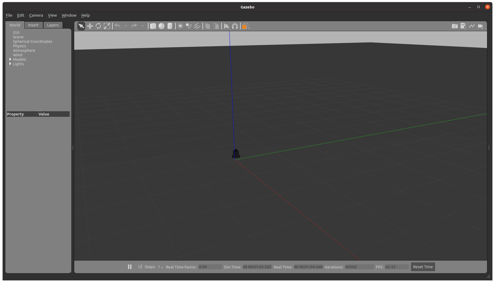
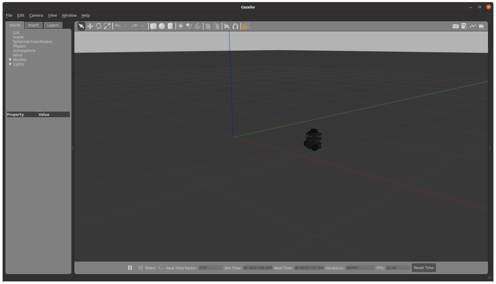
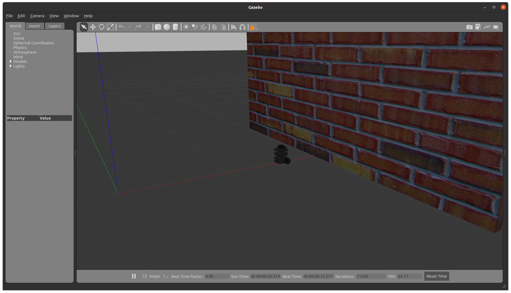

## TurtleBot3 Control

Package Name: turtlebot3_control <br>
ROS Version: Noetic <br>
Required Package: Gazebo <br>

This package contains 4 different routines performed on the Turtlebot3 Burger in Gazebo Simulation.

### How to Run
Clone the repository and follow the instructions in top-level README file.
```
$ roslaunch turtlebot3_control circle.launch # Replace the launch file name with any other
```

### Demo
All programs run in the Gazebo Simulation Environment
1. circle.py: Run the turtlebot in a circle

2. square.py: Run the turtlebot in 2x2 square with linear velocity = 0.3 and angular velocity = 0.3 

3. move.launch: Requires use input in lanch for argument 'code' that will then pick any of the above scripts to run.
```
$ roslaunch turtlebot3_control move.launch code:=square
```
4. emergency_stop.py: Turtlebot performs an 'emergency breaking' maneuver when detected an obstacle in its path using LIDAR scan.


### Demo Videos
Videos folder inside the package contains demo runs of all three scripts.
